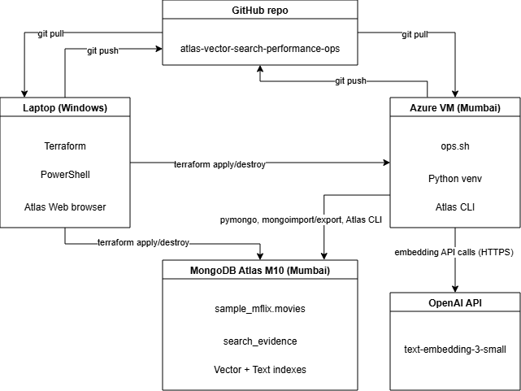

# Atlas Vector Search Performance Ops



A Database DevOps investigation into how MongoDB Atlas Vector Search behaves as data volume increases. The study involved provisioning an M10 Atlas cluster, generating embeddings for a movie dataset using OpenAI, and then doubling the dataset size by importing synthetic records. Vector Search, Text Search, and Hybrid Search performance were measured and compared at both data volumes.

The entire lifecycle is contain of infrastructure provisioning, data loading, embedding generation, index creation, search execution, dataset scaling, performance measurement, evidence collection, and environment teardown—was automated through a single menu-driven launcher script and managed using Terraform.


## Approach

I provisioned an M10 cluster in MongoDB Atlas in the AWS Mumbai region and loaded the `sample_mflix.movies` dataset into the cluster. At that stage, the dataset contained approximately 20,200 movie documents. I then generated vector embeddings for the movie plots using OpenAI's `text-embedding-3-small` model.

Next, I evaluated Vector Search, Text Search, and Hybrid Search against the dataset. In the second phase of the investigation, I expanded the dataset by generating and importing an additional 20,000 synthetic movie records. This allowed me to compare the behavior and performance of Vector Search, Text Search, and Hybrid Search at two different data volumes:

- **Stage 1:** ~20,200 embedded movie documents (sample dataset only)
- **Stage 2:** ~40,200 embedded movie documents (sample dataset + 20,000 synthetic records)

The entire investigation was orchestrated through a menu-driven launcher script, `ops.sh`, running on an Azure VM. The script served as a single operational surface for the complete lifecycle of the experiment, including loading sample data, generating embeddings, creating search indexes, executing searches, generating synthetic data, importing datasets, collecting evidence, and exporting results.

For evidence collection, each search execution wrote a document to the `search_evidence` collection. Every evidence document captured the search query, search type, wall-clock latency, and the top five returned results. Four search queries were executed against each search type at both dataset stages, resulting in a total of 24 evidence documents for analysis and comparison.

### Search strings

- `everyone is a suspect murder mystery`
- `humorous and lighthearted entertainment`
- `captain`
- `ranveer singh`

## Headline Result

Average wall-clock latency in milliseconds (n=4 per cell):

| Search type | 20k embedded | 40k embedded | Change |
|---|---|---|---|
| Vector | 3,578.49 | 10,004.55 | **+179.6%** |
| Text | 196.15 | 122.98 | −37.3% |
| Hybrid | 4,284.85 | 4,160.35 | −2.9% |

Vector tripled. Text stayed under 200ms. Hybrid barely moved.

## Performance Insights

From the Atlas metrics, I observed that during Stage 2, available memory on the M10 cluster decreased to approximately 50–100 MB out of the 2 GB available to the node, indicating significantly higher memory utilization compared to Stage 1. System CPU iowait peaked at 118.69%, indicating that multiple CPU cores were spending significant time waiting for disk I/O operations to complete. In contrast, Search Process CPU utilization peaked at only 52%, and Search Process Memory remained stable at approximately 490 MB. This suggests that the workload was primarily constrained by storage performance rather than CPU or memory resources.

This pattern typically indicates that `mongot` was not CPU-bound, but the system was under memory pressure. With insufficient free RAM, portions of the vector index were likely no longer resident in memory, forcing disk reads during query execution. Those disk reads caused high iowait, which caused the 10-second latency.

## Cost Summary

- Atlas M10 cluster (~6 hours): **~₹55–65**
- Azure VM Standard_B2s (~7 hours): **~₹20–25**
- OpenAI embeddings (~40,000 records): **~₹3–4**
- **Total Cost: ~₹80–95**

The whole investigation — from cluster provisioning to teardown — cost under ₹100.

## Key Takeaways

- The M10 cluster's 2 GB RAM acts as a practical ceiling for this workload. With approximately 40,000 embeddings at 1,536 dimensions, combined with the application working set, the vector index could no longer be fully retained in memory. As a result, query latency increased from manageable levels to several seconds, making the experience significantly less responsive.

- Atlas Search operates through `mongot`, a process separate from `mongod`. CPU and memory utilization for `mongot` are reported independently in Atlas metrics and do not necessarily correlate with MongoDB server metrics. Focusing solely on `mongod` metrics would have obscured the actual performance bottleneck.

- Hybrid Search exhibited a latency floor of roughly 4 seconds on the M10 cluster. This latency appeared to be driven primarily by the cost of executing both the vector and text search pipelines and then performing result fusion. Doubling the dataset size from approximately 20,000 to 40,000 documents had little impact on this baseline latency.

- Text Search remained an order of magnitude faster than Vector Search throughout both stages of the investigation. For queries where keyword matching is sufficient, Text Search provides substantially better performance with minimal loss of relevance, making Vector Search difficult to justify on a resource-constrained cluster.

## Repository Layout

```
atlas-vector-search-performance-ops/
├── README.md                       # This file
├── architecture.png                # System architecture diagram
├── findings.pdf                    # Detailed analysis with screenshots
├── ops.sh                          # Menu-driven operational launcher
├── infra/                          # Terraform: Azure VM
├── infra-atlas/                    # Terraform: Atlas project + cluster
├── scripts/
│   ├── generate_embeddings.py      # Batched OpenAI embedding pipeline
│   ├── generate_synthetic_movies.py
│   └── synthetic_data_pools.json
├── queries/
│   ├── evidence.py                 # Shared evidence-capture helper
│   ├── vector_search.py
│   ├── text_search.py
│   └── hybrid_search.py
├── index_definitions/
│   ├── vector_index.json           # Atlas Vector Search index
│   └── text_index.json             # Atlas Search (text) index
├── evidence/
│   └── search_evidence.json        # 24 evidence documents from both stages
├── runbooks/
│   ├── 01-ssh-blocked-after-ip-change.md
│   └── 02-atlas-search-index-format.md
├── requirements.txt
└── .gitignore
```

## Implementation Guide

To reproduce this investigation, you need:

- A MongoDB Atlas account with billing set up
- An Azure subscription
- An OpenAI API key with billing set up
- Terraform installed locally
- A bash environment (the VM provides this; the laptop uses PowerShell)

Setup proceeds in two stages:

**Stage 1 — Provision infrastructure (from laptop):**

```
cd infra
terraform init && terraform apply       # Azure VM

cd ../infra-atlas
terraform init && terraform apply       # Atlas project + M10 cluster
```

**Stage 2 — Run the investigation (from the provisioned VM):**

```
git clone <repo-url>
cd atlas-vector-search-performance-ops
python3 -m venv .venv && source .venv/bin/activate
pip install -r requirements.txt

# Configure .env with ATLAS_URI and OPENAI_API_KEY

./ops.sh
```

The `ops.sh` menu walks through each step: load sample data, generate embeddings, create indexes, run searches, generate synthetic data, import it, export evidence.

**Teardown:**

```
cd infra-atlas
terraform destroy

cd ../infra
terraform destroy
```
